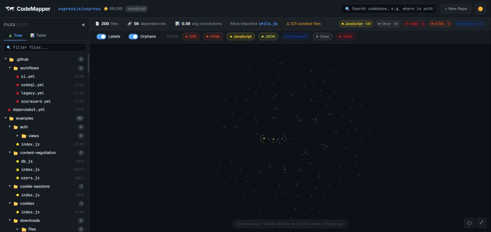
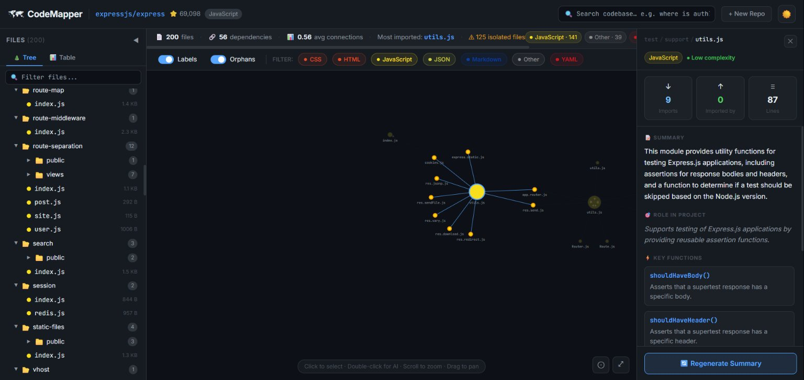
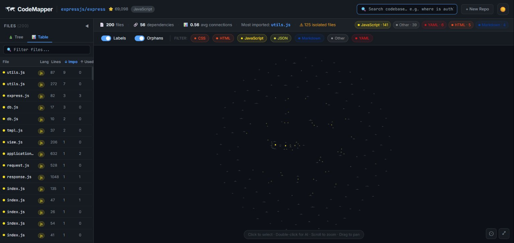
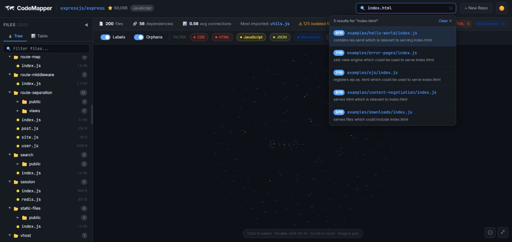

# 🗺 CodeMapper

### AI-powered GitHub Repository Visualizer

**Paste any public GitHub URL → get an interactive dependency graph → click any file for an AI explanation → search your entire codebase in plain English.**

[](LICENSE)
[](https://nodejs.org)
[](https://react.dev)
[](https://d3js.org)
[](https://console.groq.com)

</div>

---

## 📸 Screenshots

### Interactive Dependency Graph
> Nodes sized by import popularity, colored by language. Zoom, pan, and drag freely.



### AI-Powered File Summaries
> Double-click any node — Claude/Groq explains what the file does, its exports, key functions, and complexity.



### Semantic Code Search
> Ask in plain English. Get ranked results with reasoning.



### File Tree + Table View
> Switch between tree and sortable table. Filter, sort by lines/imports/usage.



---

## ✨ Features

| Feature | Description |
|---------|-------------|
| 🕸 **Force Graph** | Interactive D3.js v7 graph — nodes sized by how many files import them |
| 🤖 **AI Summaries** | Per-file explanations: summary, exports, key functions, complexity rating |
| 🔍 **Semantic Search** | "Where is auth handled?" → ranked file results with reasons |
| 🌲 **File Tree** | Collapsible folder tree, stable across interactions (no resets) |
| 📊 **Table View** | Sortable flat list — sort by lines, imports, usage |
| 🎨 **Light / Dark Mode** | Toggle anytime, preference saved across sessions |
| 🔤 **Language Filters** | Show/hide by language in one click |
| ⚠️ **Orphan Detection** | Highlights files with no import relationships |
| ⚡ **Smart File Scoring** | Core source files fetched first, test/fixture files deprioritized |
| 💾 **Session Cache** | Repo analysis and AI summaries cached — no repeat fetches |

---

## 🆓 100% Free AI Options

| Provider | How to get it | Speed | Requirements |
|----------|--------------|-------|--------------|
| **Groq** | [console.groq.com](https://console.groq.com) — sign up free | ⚡ Very fast | No credit card |
| **Ollama** | [ollama.com](https://ollama.com) — runs locally | 🏠 Local | ~4GB RAM, no internet needed for AI |

---

## 🛠 Tech Stack

| Layer | Technology |
|-------|-----------|
| Frontend | React 18 + Vite + Tailwind CSS |
| Graph | D3.js v7 (force-directed, zoom/pan/drag) |
| Backend | Node.js 20 + Express |
| AI | Groq API (`llama-3.3-70b`) or Ollama (local) |
| Data Source | GitHub REST API v3 |
| Styling | Pure CSS variables — full light/dark theme |

---

## 🚀 Quick Start

### Prerequisites
- [Node.js 20+](https://nodejs.org)
- A free [Groq API key](https://console.groq.com) **or** [Ollama](https://ollama.com) installed locally
- A [GitHub token](https://github.com/settings/tokens) *(optional — avoids 60 req/hr rate limit)*

### 1. Clone

```bash
git clone https://github.com/vishaldevasani/codemapper.git
cd codemapper
```

### 2. Install all dependencies

```bash
npm run install:all
```

### 3. Configure environment

```bash
cp server/.env.example server/.env
```

Open `server/.env` and fill in your keys:

**Option A — Groq (recommended, 2-minute setup):**
```env
PORT=3001
GITHUB_TOKEN=ghp_your_token_here        # optional
GROQ_API_KEY=gsk_your_key_here          # free at console.groq.com
```

**Option B — Ollama (fully local, no API key needed):**
```env
PORT=3001
GITHUB_TOKEN=ghp_your_token_here        # optional
AI_PROVIDER=ollama
OLLAMA_MODEL=llama3.2
```
Then pull a model: `ollama pull llama3.2`

### 4. Run

```bash
npm run dev
```

Open **[http://localhost:5173](http://localhost:5173)** in your browser.

---

## 🎮 How to Use

1. **Paste a GitHub URL** on the landing page and click Analyze
2. **Explore the graph** — bigger nodes = more imported by other files
3. **Click a node** → highlights it and its neighbors, opens the detail panel
4. **Double-click a node** → generates an AI summary for that file
5. **Search** in the top bar → ask "where is routing handled?" and get ranked results
6. **Switch views** → use the Tree / Table tabs in the sidebar
7. **Filter by language** using the toolbar above the graph
8. **Toggle light/dark mode** with the ☀️/🌙 button top-right

---

## 📡 API Reference

### `POST /api/analyze`
Fetches and analyzes a public GitHub repository.

**Request:**
```json
{ "repoUrl": "https://github.com/expressjs/express" }
```

**Response:**
```json
{
  "repo": { "name": "expressjs/express", "stars": 65000, "language": "JavaScript", "url": "..." },
  "files": [{ "path": "lib/router/index.js", "language": "js", "size": 8192, "linesOfCode": 284, "content": "..." }],
  "graph": {
    "nodes": [{ "id": "lib/router/index.js", "label": "index.js", "inDegree": 4, "outDegree": 2, "isOrphan": false }],
    "edges": [{ "source": "lib/application.js", "target": "lib/router/index.js", "type": "import" }],
    "stats": { "totalFiles": 42, "totalEdges": 56, "languages": { "js": 30 }, "avgDegree": 2.7 }
  }
}
```

### `POST /api/summary`
Generates an AI explanation for a single file.

**Request:**
```json
{
  "path": "lib/router/index.js",
  "content": "...",
  "language": "js",
  "inDegree": 4,
  "outDegree": 2,
  "externalDeps": ["debug", "path-to-regexp"],
  "projectName": "expressjs/express"
}
```

**Response:**
```json
{
  "summary": "The main router implementation that matches HTTP routes to handlers...",
  "exports": ["Router"],
  "role": "Core routing engine that dispatches incoming requests to registered route handlers.",
  "keyFunctions": [{ "name": "Route", "description": "Registers a new route for a given path" }],
  "complexity": "high",
  "externalDeps": ["debug", "path-to-regexp", "methods"]
}
```

### `POST /api/search`
Semantically ranks files by relevance to a natural language query.

**Request:**
```json
{
  "query": "where is authentication middleware?",
  "files": [{ "path": "lib/router/layer.js", "content": "..." }]
}
```

**Response:**
```json
{
  "results": [
    { "path": "lib/router/layer.js", "relevance": 8, "reason": "Handles middleware layer execution in the route stack" }
  ]
}
```

---

## 🏗 Architecture

```
Browser (localhost:5173)
  │
  ├── React 18 + Vite
  │     ├── D3.js Force Graph  (SVG, zoom/pan/drag/click)
  │     ├── File Tree Sidebar  (stable open state, no resets)
  │     ├── Table View         (sortable file list)
  │     ├── AI Detail Panel    (summaries, exports, functions)
  │     └── Semantic Search    (natural language → ranked files)
  │
  └── Express Server (localhost:3001)
        ├── POST /api/analyze  → GitHub API → parse imports → build graph
        ├── POST /api/summary  → Groq/Ollama → AI file explanation (cached)
        └── POST /api/search   → Groq/Ollama → semantic file ranking
```

---

## 📁 Project Structure

```
codemapper/
├── client/
│   └── src/
│       ├── components/
│       │   ├── Graph/           D3.js force-directed graph
│       │   ├── Sidebar/         File tree + table view
│       │   ├── DetailPanel/     AI summary right panel
│       │   ├── SearchBar/       Semantic search + results dropdown
│       │   ├── StatsBar/        Repo metrics + language badges
│       │   ├── Navbar/          Top bar with theme toggle
│       │   └── LoadingScreen/   Animated analysis progress
│       ├── hooks/
│       │   ├── useGraph.js      Graph state, filtering, highlighting
│       │   ├── useSummary.js    AI summary fetch + session cache
│       │   ├── useSearch.js     Search state + highlighted paths
│       │   └── useTheme.js      Light/dark mode + localStorage
│       ├── services/api.js      All API call functions
│       └── utils/languageColors.js
│
└── server/
    └── src/
        ├── controllers/         Route handlers (analyze, summary, search)
        ├── services/
        │   ├── githubService.js  GitHub REST API (handles rate limits)
        │   ├── parserService.js  Import regex parser + graph builder
        │   ├── aiService.js      Groq + Ollama provider (auto-detect)
        │   └── cacheService.js   In-memory Map cache
        ├── routes/index.js
        └── utils/urlParser.js
```

---

## 🔧 Troubleshooting

| Problem | Fix |
|---------|-----|
| `Missing script: install:all` | You're in the wrong folder — `cd` to the root `codemapper/` folder first |
| Graph shows 0 dependencies | Normal for repos with no import relationships (e.g. pure data repos). Try `expressjs/express` |
| AI summary fails | Check `GROQ_API_KEY` in `server/.env`. Get a free key at [console.groq.com](https://console.groq.com) |
| GitHub rate limit error | Add `GITHUB_TOKEN` to `server/.env` — [get one free](https://github.com/settings/tokens) (no scopes needed) |
| Port already in use | Change `PORT=3002` in `server/.env` |
| Blank page | Make sure both servers started — you should see two lines in the terminal |

---

## 🤝 Contributing

1. Fork the repo
2. Create a branch: `git checkout -b feat/your-feature`
3. Make your changes
4. Open a Pull Request

---

## 📄 License

MIT — free to use, modify, and distribute.
